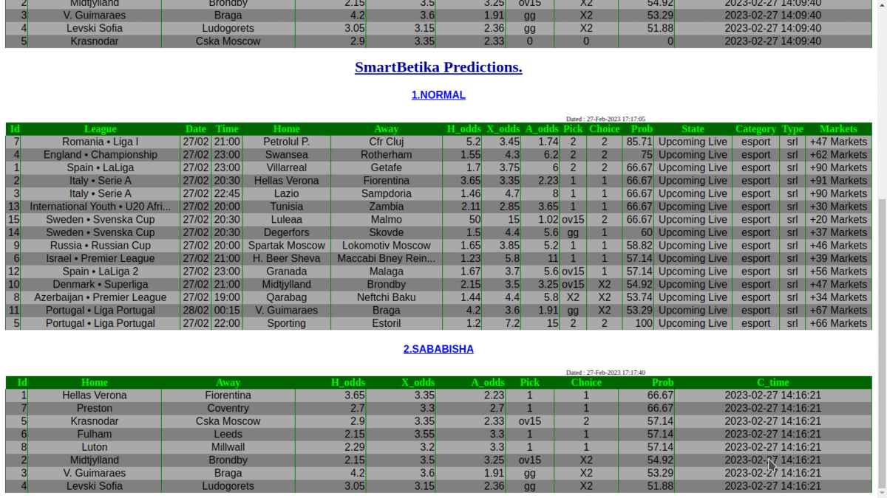

<h1 align="center">smartBetika</h1>
<p align="center">
 <a href="https://github.com/Simatwa/smartBetika"></a>
<a href="LICENSE"></a>
 <a href="#"></a> 
 <a href="https://github.com/psf/black"></a> 
 <a href="#"></a> 
 <a href="#"></a> 
 <a href="#"></a>  
 <a href="#" alt="Development"></a> 
 <a href="https://wakatime.com/badge/github/Simatwa/smartBetika"></a>
 <!-- <a href="https://pepy.tech/project/smartBetika"></a></p><br> -->

> Get Football predictions based on [Betika](https://betika.com) platform.

Ranging from Upcoming, Sababisha, Midweek-Jackpot and Jackpot matches.



## Prerequisites

1. [Google Chrome](https://www.google.com/chrome/)
2. [Python >=3.9](Python.org)
3. [Git](https://git-scm.com) (Optional)

## Installation and Usage

### Installation 

Either of the following methods will help you to get started while at the terminal environment.

- Cloning the repo locally.

```bash
$ git clone https://github.com/Simatwa/smartBetika.git
$ cd smartBetika 
$ bash install.sh 
   #or
$ sudo bash install.sh
```

- Using Python's pip

 ```bash
 $ pip3 install git+https://github.com/Simatwa/smartBetika.git
 ```

### Usage

This script can only retrieve matches from the mentioned site thus relies on  [smartbetsAPI](Simatwa/smartbetsAPI) to make predictions.

Fire up the REST-api as stated in the [documentation](Simatwa/smartbetsAPI).

*For instance:*

```bash
$ smartbetsAPI developer -p 8080
```


On another window, execute the script parsing commands as per your needs.

For instance,if you want the script to predict a maximum of 15 matches of the day and Sababisha matches available, save the predictions in html format to `sababisha.html` file, take screenshot on every page visited and scrolls made and finally save the screenshots in `Screenshots` folder:

```bash
$ betika --normal --sababisha --predict --screenshot -dir Screenshots -tbl html
```


Fot further info run `betika -h`:

```
usage: betika [-h] [-v] [-pn PHONE] [-pas PASSWORD] [-lg LEAGUE] [-amt AMOUNT]
              [-scr SCROLLS] [-slp SLEEP] [-api HOST] [-user USERNAME]
              [-psd PASWD] [-drv DRIVER] [-tbl {grid,orgtbl,pretty,html}]
              [-dir PATH] [--disable-incognito] [--normal] [--grandjp]
              [--midjp] [--sababisha] [--upcoming] [--predict] [--screenshot]
              [--net] [--post] [--verbose] [--no-clear] [--display]
              [--get-API]
              [output]

Football-Punter's favorite girlfriend - based on Betika platform!

positional arguments:
  output                Filepath for saving the predictions

optional arguments:
  -h, --help            show this help message and exit
  -v, --version         show program's version number and exit
  -pn PHONE, --phone PHONE
                        Phone number for authenticating login [Betika]
  -pas PASSWORD, --password PASSWORD
                        Pass-key associated with the phone number
  -lg LEAGUE, --league LEAGUE
                        Filter specific league or country of the teams
                        [Normal]
  -amt AMOUNT, --amount AMOUNT
                        Maximum number of matches to predict
  -scr SCROLLS, --scrolls SCROLLS
                        Number of times to scroll on updating matches [Normal]
  -slp SLEEP, --sleep SLEEP
                        Period for waiting after refreshing JS delivered
                        contents
  -api HOST, --host HOST
                        Web url for the prediction API
  -user USERNAME, --username USERNAME
                        Username for authenticating at the API
  -psd PASWD, --paswd PASWD
                        Password for authenticating at the API
  -drv DRIVER, --driver DRIVER
                        Chromedriver executable path [download - loads new]
  -tbl {grid,orgtbl,pretty,html}, --table {grid,orgtbl,pretty,html}
                        Table type to be used in formatting the data
                        [tabulate]
  -dir PATH, --path PATH
                        Directory for saving the screenshots
  --disable-incognito   Start browser in non-incognito mode
  --normal              Specifies to handle match-highlights of the day
  --grandjp             Specifies to handle grand-jackpot matches
  --midjp               Specifies to handle midweek-jackpot matches
  --sababisha           Specifies to handle sababisha matches
  --upcoming            Specifies to handle upcoming matches
  --predict             Proceed to predicting on the matches
  --screenshot          Take screenshot on every page visited
  --net                 Instruct API to fetch team_data from web
  --post                Use post method when interacting with API
  --verbose             Output all team data in the specified filepath
  --no-clear            Not to delete the files used by the script
  --display             Run Chrome browser in GUI
  --get-API             Request the API program for making predictions from
                        the DEVELOPER.

[*] This program is disseminated under MIT-FPA license.
```

## Disclaimer

The information provided in [this GitHub repo](https://github.com/Simatwa/smartBetika) is for informational purposes only. This repo should not be taken as legal, financial or any other form of professional advice. The [author of this repo](https://github.com/Simatwa) shall not be liable for any copyright-infringement issues, losses or damages incurred as a result of the information contained in this repo. 

## Credits

- [x] [Betika](https://betika.com)
